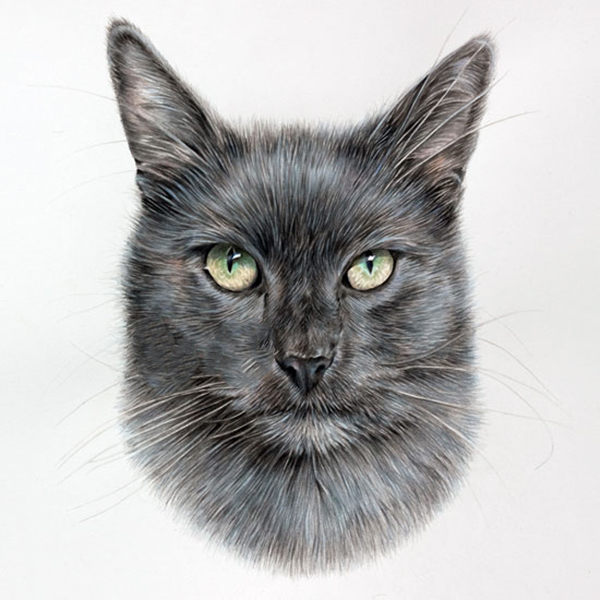
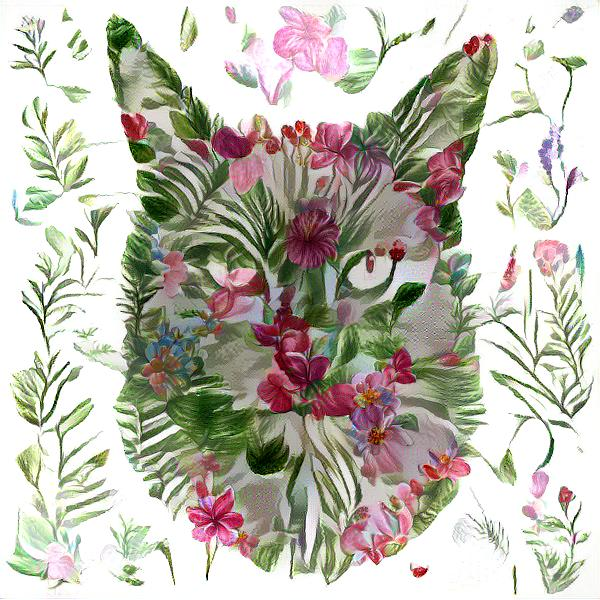
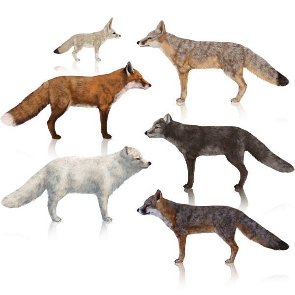
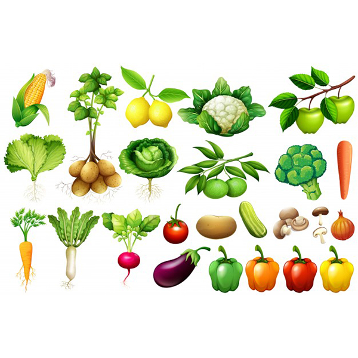
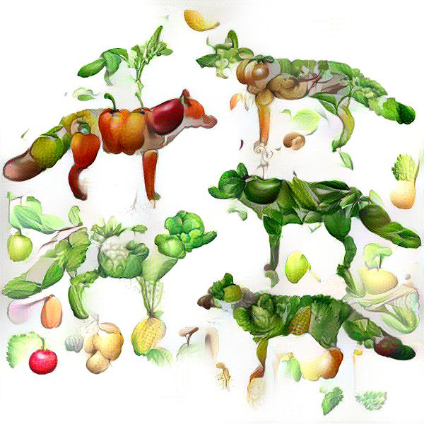
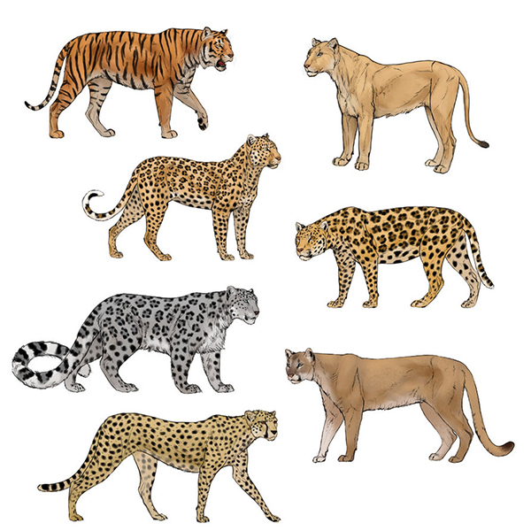
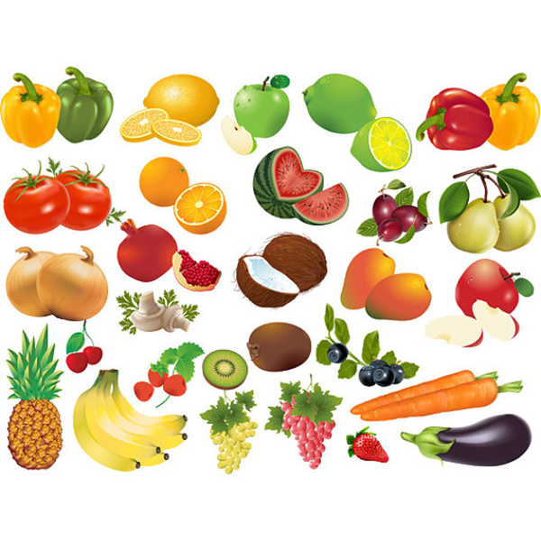
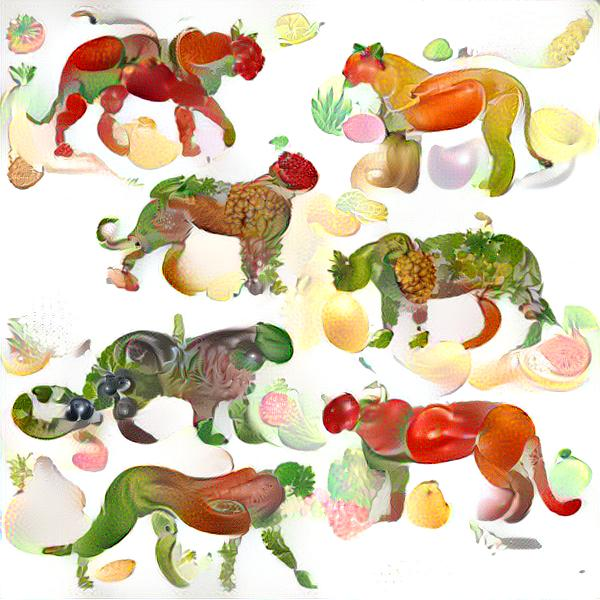

# Style Transfer 
## with Tensorflow Eager Execution 
[blog post](https://beaugogh.github.io/20180825?title=Style%20Transfer&stamp=20180825)

### Examples: fruity and leafy animals

| Content | Style | Output |
| ------- | ----- | ------ |
|  |  |  |
|  |  |  |
|  |  |  |

------------------------------------------

### How to Run:

* Prerequisites: 
	* Python 3 
	* Tensorflow 1.9+
	* GPU recommended (Nvidia GTX1060+ )
	
* Run: 
	* All the parameters can be found in the constructor of [StyleTransfer](./style_transfer.py)
	* Modify `img_height` and `img_width` to your images
	* Modify `content_pic_name` and `style_pic_name` to your images
	* Do `python3 main.py` to run
	* Resulting images are saved to directory `./output/`
	* Checkpoints are periodically saved to directory `./checkpoints/` so that you can resume where you left anytime

### Parameter tuning:

* The default parameters work decently, but no harm in tweaking them.
* For smoother, blurrier outputs, increase the weight on variational cost (`variation_weight`).
* Increase `style_weight` for stronger style, increase `content_weight` for stronger content.
* Gradient descents do not always decrease the total loss, due to suboptimal calculation and/or relatively large learning rate. Only images with reduced loss are saved. Iterations with increased loss are ignored, when certain percentage of the all the iterations (`miss_percentage_threshold`) are ignored, it is time to lower the learning rate to its `lr_decay_rate` amount.

### Notes:
This repo is inspired by [Standford Tensorflow Course](https://github.com/chiphuyen/stanford-tensorflow-tutorials) and [this tutorial](https://medium.com/tensorflow/neural-style-transfer-creating-art-with-deep-learning-using-tf-keras-and-eager-execution-7d541ac31398) on style transfer with eager execution. 

Compared to the previous works, this repo combines the following:

* tensorflow eager execution instead of graph execution
* organizing the code in an object-oriented manner,
* including variational loss in the total loss definition
* making learning rate automatically adapt to finer gradient descents 
* periodically saving checkpoints for lor later use

	